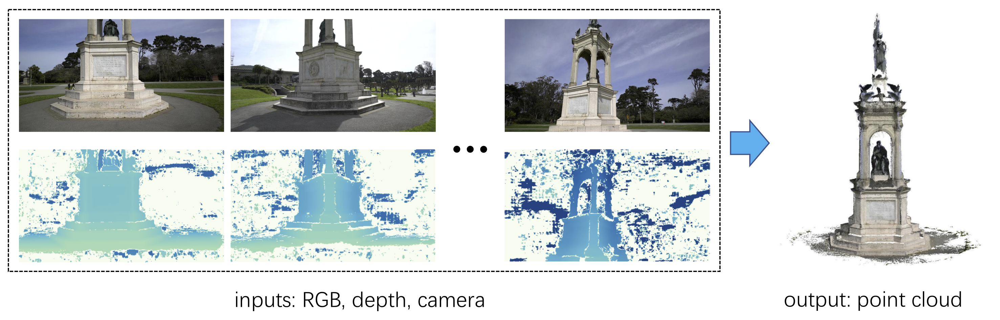
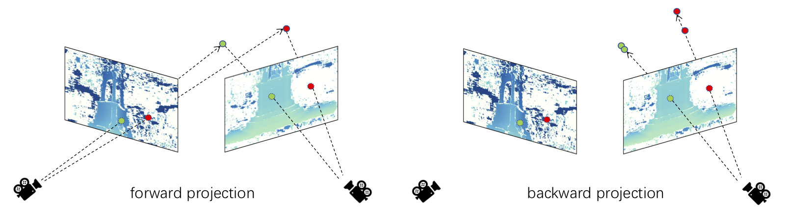

# Depth Fusion with Consistency Check for COLMAP

## Requirements

* python 3.8 (Anaconda)
* ``pip install -r requirements.txt``

## Consistency Check

## Usage
* In ``run.sh``, set ``root_path`` to the top directory, the organization is compatible with the outputs of [COLMAP](https://https://github.com/colmap/colmap). If you want to process your custom data, please modify the ``load_data`` function 
* Adjust ``prob_thresh``, ``dist_thresh`` and ``num_consist`` accordingly
* ``bash run.sh``

## Explain

This repository is modified from [DepthFusion](https://github.com/touristCheng/DepthFusion) and [COLMAP](https://https://github.com/colmap/colmap). Cause [COLMAP](https://https://github.com/colmap/colmap) doesn't provide a convenient way to export image sequence number corresponding to dense point cloud, I modified some codes on [DepthFusion](https://github.com/touristCheng/DepthFusion) to realize this function. Besides, I have made some optimizations to accelerate fusion and reduce the occupation of HD photos on video memory

